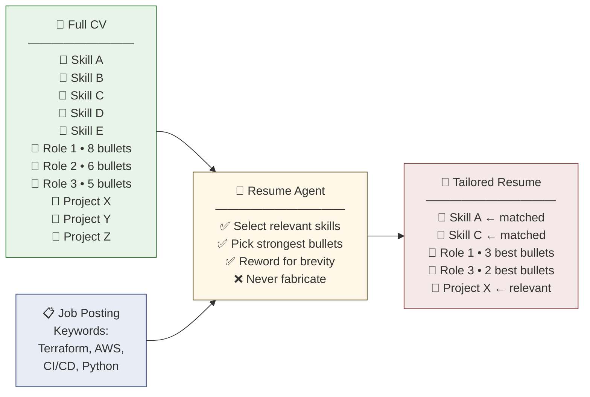

# Resume Tailoring Workflow

**Commands:** `.claude/commands/tailor-resume.md` (1-page) and `.claude/commands/tailor-resume-full.md` (2-page)
**Agents:** `resume-tailoring`, `resume-tailoring-2page`, `cover-letter` (in `.claude/agents/`)

## What It Does

Generates keyword-optimized DOCX resumes (and optionally cover letters) tailored to specific job postings. Each job in `config/target_jobs/` gets its own resume that highlights the most relevant experience from your full CV.

## Prerequisites

- [Claude Code](https://claude.com/claude-code) VS Code extension (requires Claude Pro or API key)
- Python dependencies installed (`pip install -r requirements.txt`)
- LibreOffice (optional, for viewing DOCX and converting to PDF)

> **Note:** These commands run through Claude Code's slash command system, not GitHub Copilot prompts. If you don't have Claude Pro, the commands would need to be migrated to `.github/prompts/` for use with Copilot.

## End-to-End Workflow

### 1. Collect Job Postings

After running discovery workflows, open `results/application_queue.csv` in a spreadsheet program (LibreOffice, Excel, Google Sheets) and review the results.

For each promising position:
1. Open the job URL in your browser
2. Clip the job posting to markdown -- I use the [Obsidian Web Clipper](https://obsidian.md/clipper) browser extension for clean markdown output
3. Save the markdown file to `config/target_jobs/`

If a position doesn't fit, consider adding the company to `config/exclusions.yml` to avoid seeing it again.

### 2. Generate Resumes

Open Claude Code in VS Code, then run a slash command:

- **`/tailor-resume`** -- Generates a 1-page keyword-optimized resume per job posting
- **`/tailor-resume-full`** -- Generates a 2-page resume + cover letter per job posting

> macOS users: You may need to unlock the keychain for Claude Code authentication. I use a script for this.

Each subagent reads the job posting, extracts keywords, matches them against `config/cv_full.md`, and generates a DOCX file using the template in `resumes/reference/template.docx`.

Output goes to `resumes/generated/tailored/`.

### 3. Review and Adjust

Open the generated DOCX files in a word processor and check:

- **Fit:** Does the resume fit the target page count? (2 pages for resume, 1 page for cover letter)
- **Accuracy:** Did the AI fabricate any skills or experiences you don't actually have? This is critical -- always sanity-check.
- **Formatting:** Does it match the template? Minor adjustments may be needed.

### 4. Convert to PDF

When satisfied with the DOCX files:

```bash
./resumes/generated/tailored/convert-to-pdf.sh
```

This generates PDFs of all DOCX files in the directory. **Requires LibreOffice installed.**

### 5. Apply and Update Exclusions

After applying, add the companies to `config/exclusions.yml` so future discovery runs don't surface positions you've already applied to.

## Writing Style Guide (`docs/writing_style_guide.md`)

The resume tailoring agents include built-in anti-AI-detection rules (avoid "leveraged," "spearheaded," etc.), but these defaults only get you halfway. For resumes that genuinely sound like you wrote them, create a writing style guide with samples of your actual writing.

See [docs/writing_style_guide.md](writing_style_guide.md) for a template with instructions on how to populate it with your own voice. The agents automatically read this file if it exists.

**Why bother?** Recruiters are increasingly spotting and discarding AI-generated resumes. The telltale signs aren't just banned words -- it's the uniform cadence, the lack of personality, the same structure in every bullet. A style guide grounded in your real writing is what separates a polished AI-assisted resume from an obvious AI-generated one.

## About the Full CV (`config/cv_full.md`)

The resume tailoring system works best with a **comprehensive** full CV. The idea is to maintain a large pool of your entire professional experience described in as much detail as possible. The AI then selects the most relevant items for each specific job posting.



**Key principle:** The AI is explicitly instructed to never fabricates skills or experiences (trust, but verify the results). It only selects and rewords entries that already exist in your full CV. This is why comprehensiveness matters -- the more raw material you provide, the better the AI can match your real experience to each job posting.

This isn't obvious when using the 2-page workflow (which has room for most experience), but becomes critical for 1-page resumes where the AI must make tough choices about what to include.

The example `config/cv_full.md` is intentionally brief as a template. For reference, a real full CV might be 200+ lines covering every role, project, and technical detail from your career. Fill it out as completely as possible for best results.

## 1-Page vs. 2-Page

| | 1-Page (`/tailor-resume`) | 2-Page (`/tailor-resume-full`) |
|---|---|---|
| Word count | ~450 words | ~900 words |
| Cover letter | No | Yes |
| Best for | When the posting requests 1-page, or for roles closely matching your core skills | General use, recommended by career coaches for mid-career professionals |

## Related

- [ATS Platform Search](ats-platform-search.md) -- Discover positions to tailor resumes for
- [Hiring Cafe Search](hiringcafe-job-search.md) -- Another source of positions
