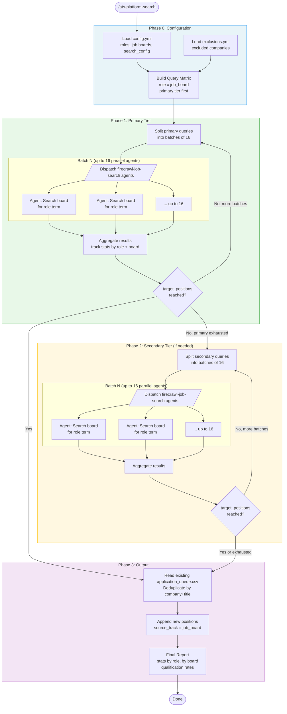
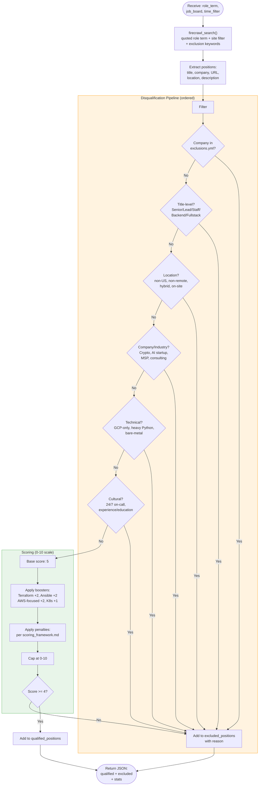

# ATS Platform Search Workflow

Searches multiple ATS platforms (Greenhouse, Lever, Ashby, etc.) for infrastructure roles using the Firecrawl MCP Server.

## Overview

The orchestrator builds a query matrix of **roles x job boards**, dispatches parallel Firecrawl search agents in batches, then aggregates and deduplicates results into the application queue.

## Flow Diagram

## Firecrawl Job Search Agent Detail

Each dispatched agent executes in isolation with clean context:

## Key Configuration

| Config File | Used For |
|---|---|
| `config/config.yml` | Job boards list, primary/secondary role terms, search_config (time_filter, search_limit) |
| `config/exclusions.yml` | Companies to skip before any scoring |
| `shared/scoring_framework.md` | Boosters, penalties, disqualifiers for scoring |
| `results/application_queue.csv` | Deduplication target + output destination |
