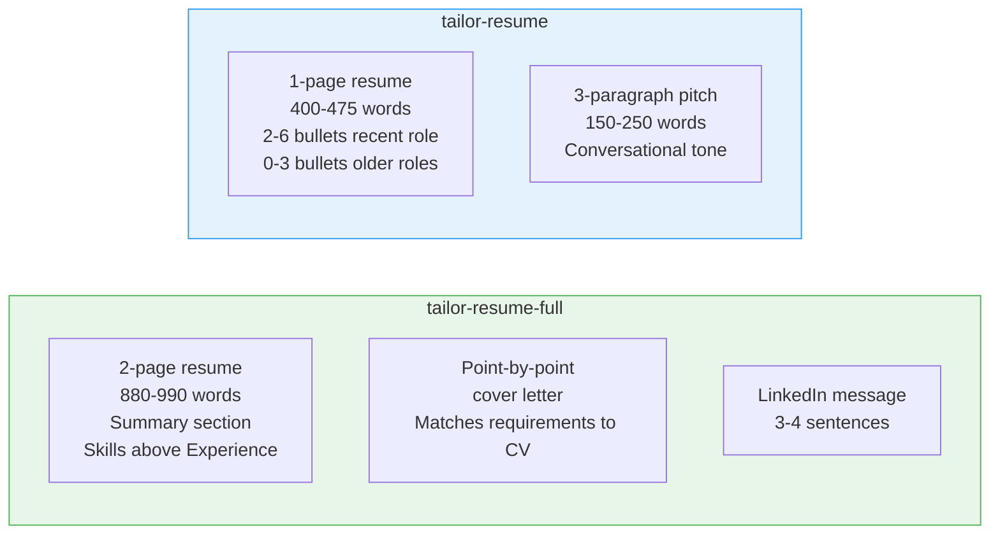
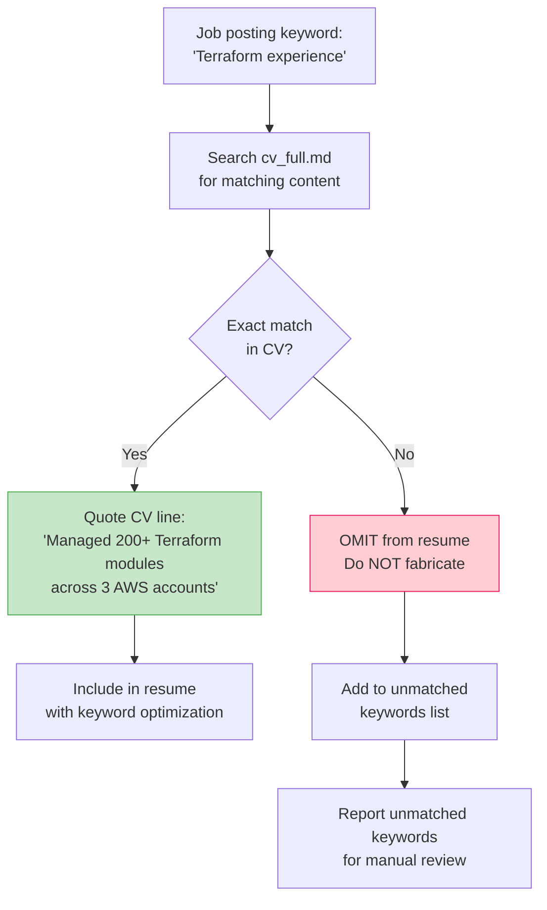

# Resume Tailoring Workflow

Matches keywords from job postings against a full CV, then generates tailored resumes, cover letters, and LinkedIn outreach messages. Two variants exist: a compact version (1-page resume + pitch letter) and a full version (2-page resume + detailed cover letter + LinkedIn message).

## Overview

The user manually extracts job postings into `config/target_jobs/` as markdown files. The orchestrator discovers these files, builds a task queue, then processes each job posting sequentially through dedicated agents. Sequential execution is mandatory to prevent hung tasks and permission conflicts.

## Flow Diagram (Full Variant)

```mermaid
flowchart TD
    Start([/tailor-resume-full]) --> LoadConfig

    subgraph init ["Phase 0: Configuration"]
        LoadConfig["Load config/cv_full.md<br>(complete work history)"]
        LoadPrefs["Load config/job_preferences.md<br>(work arrangement, salary)"]
        LoadStyle["Load config/profile/writing_style_guide.md<br>(plain verbs, no em dashes)"]
        LoadConfig --> Scan
        LoadPrefs --> Scan
        LoadStyle --> Scan
    end

    Scan["Scan config/target_jobs/<br>for markdown files"] --> Found

    Found{Files found?}
    Found -->|None| Stop([STOP: inform user<br>to add job postings])
    Found -->|Yes| BuildQueue

    BuildQueue["Build task queue:<br>parse 'Company - Title.md'<br>from each filename"] --> JobLoop

    subgraph processing ["Sequential Processing (one job at a time)"]
        JobLoop["FOR each job posting<br>(NEVER parallel)"]
        JobLoop --> ReadPost["Read job posting markdown<br>Extract keywords, requirements,<br>responsibilities"]

        ReadPost --> ResumeAgent

        subgraph resume ["Agent 1: Resume Generation"]
            ResumeAgent["resume-tailoring-2page agent"]
            ResumeAgent --> ExtractKW["Extract job keywords:<br>skills, tools, frameworks"]
            ExtractKW --> MatchCV["Match against cv_full.md<br>Source verification:<br>quote exact CV line<br>for each inclusion"]
            MatchCV --> BuildResume["Build 2-page resume:<br>880-990 words<br>Summary + Skills above Experience<br>All roles with bullets"]
            BuildResume --> WriteResume["Write .docx<br>resumes/generated/tailored/"]
        end

        WriteResume --> WaitResume["WAIT for completion"]
        WaitResume --> CoverAgent

        subgraph cover ["Agent 2: Cover Letter"]
            CoverAgent["cover-letter agent"]
            CoverAgent --> MatchReqs["Map job requirements<br>to CV achievements<br>point-by-point"]
            MatchReqs --> WriteCover["Write cover letter .docx<br>Verified content only"]
        end

        WriteCover --> WaitCover["WAIT for completion"]
        WaitCover --> LinkedInAgent

        subgraph linkedin ["Agent 3: LinkedIn Message"]
            LinkedInAgent["linkedin-message agent"]
            LinkedInAgent --> CraftMsg["3-4 sentence outreach<br>Reference specific role details<br>Conversational tone"]
            CraftMsg --> WriteMsg["Write .txt file"]
        end

        WriteMsg --> WaitLinkedIn["WAIT for completion"]
        WaitLinkedIn --> MarkDone["Mark job as completed"]
        MarkDone --> MoreJobs{More jobs?}
        MoreJobs -->|Yes| JobLoop
    end

    MoreJobs -->|No| Cleanup

    subgraph output ["Phase 2: Cleanup & Report"]
        Cleanup["Delete intermediate JSON files:<br>*_content.json<br>*_content_2page.json<br>*_cover_letter*.json"]
        Cleanup --> Verify["Verify output files exist:<br>- *_2page.docx<br>- *_Cover_Letter.docx<br>- *_linkedin.txt"]
        Verify --> Report["Final Report:<br>Company | Title<br>Files generated<br>Keywords matched<br>Unmatched keywords<br>(for manual review)"]
    end

    Report --> End([Done])

    style init fill:#e8f4f8,stroke:#2196F3
    style processing fill:#e8f8e8,stroke:#4CAF50
    style resume fill:#c8e6c9,stroke:#388E3C
    style cover fill:#fff9c4,stroke:#F9A825
    style linkedin fill:#ffe0b2,stroke:#FF9800
    style output fill:#f3e5f5,stroke:#9C27B0
```



## Compact Variant Differences

The compact variant (`tailor-resume`) produces fewer outputs with tighter constraints:



| Aspect | tailor-resume (compact) | tailor-resume-full |
|---|---|---|
| **Resume length** | 1 page (400-475 words) | 2 pages (880-990 words) |
| **Resume agent** | resume-tailoring | resume-tailoring-2page |
| **Cover letter style** | 3-paragraph pitch (150-250 words) | Point-by-point requirement matching |
| **Cover letter agent** | cover-letter-pitch | cover-letter |
| **LinkedIn message** | No | Yes |
| **Skill categories** | Max 5 | Expanded |
| **Summary section** | Omitted (saves space) | Included |

## Agent Source Verification

All agents enforce strict content rules to prevent fabrication:



Core rules enforced across all writing agents:
- **No fabrication** - only verbatim CV content
- **No inference** - skills must be explicitly listed
- **Source verification** - each inclusion cites exact CV line
- **No em dashes** - banned across all output
- **Plain verbs** - per writing style guide
- **Specific metrics** - quantified achievements preferred

## Input/Output

### Input
```
config/target_jobs/
  Acme Corp - Cloud Infrastructure Engineer.md    # Job posting markdown
  Widgets Inc - DevOps Engineer.md                # Extracted via Obsidian clipper
```

### Output (full variant)
```
resumes/generated/tailored/
  Alex_Acme_Corp_Cloud_Infrastructure_Engineer_2page.docx
  Alex_Acme_Corp_Cloud_Infrastructure_Engineer_Cover_Letter.docx
  Alex_Acme_Corp_Cloud_Infrastructure_Engineer_linkedin.txt
  Alex_Widgets_Inc_DevOps_Engineer_2page.docx
  Alex_Widgets_Inc_DevOps_Engineer_Cover_Letter.docx
  Alex_Widgets_Inc_DevOps_Engineer_linkedin.txt
```

## Key Configuration

| Config File | Used For |
|---|---|
| `config/cv_full.md` | Source of truth for all experience, skills, projects |
| `config/job_preferences.md` | Work arrangement preferences, salary expectations |
| `config/profile/writing_style_guide.md` | Tone, formatting, banned patterns (em dashes) |
| `config/target_jobs/*.md` | Job postings to tailor against (user-populated) |
| `shared/scoring_framework.md` | Referenced by agents for keyword priority |
